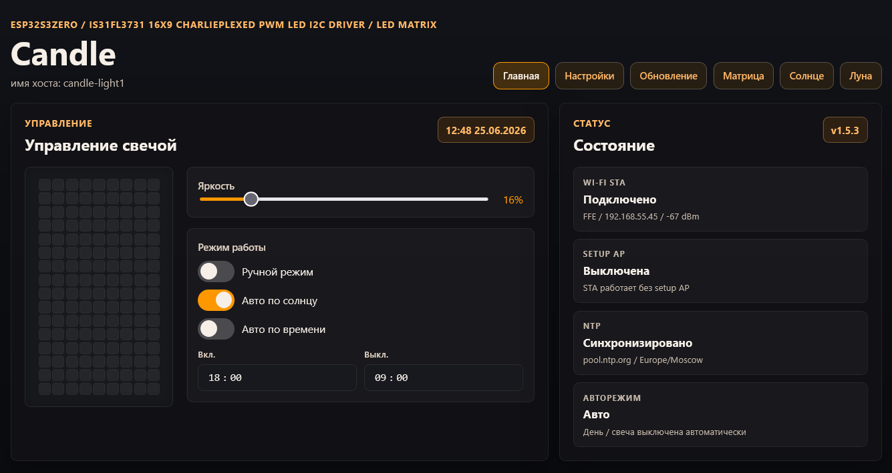

# Candle Matrix

A smart ambient light device based on a 9x16 LED matrix that simulates a candle flame and can switch output automatically from local sunrise, sunset, and twilight calculations.

The current firmware version is `1.5.3`. It runs on an ESP32-S3 board, serves a local web UI from LittleFS, exposes an HTTP API, and publishes Prometheus metrics.



[YouTube demo](https://youtu.be/k6NloHe2mFc?si=xb15nH9J5MSKqg30)

## Features

- Candle animation on a 9x16 LED matrix
- Automatic sun-based mode using on-device NOAA solar calculations
- Moon phase display
- Sun position visualization
- Optional single WS2812 moon LED on a separate GPIO; color hue and maximum brightness are controlled from the Moon page
- Brightness control from 0 to 100 percent
- NTP time synchronization with configurable primary and secondary servers
- Local web UI with captive-portal Wi-Fi setup
- HTTP API for automation
- Prometheus metrics at `/metrics`
- Web firmware and LittleFS update after the OTA partition layout is installed

## Hardware

| Component       | Description                                   |
| --------------- | --------------------------------------------- |
| ESP32-S3 Zero   | Main microcontroller module                   |
| IS31FL3731      | Charlieplexed PWM LED matrix driver over I2C  |
| 9x16 LED matrix | 144 individually controlled LEDs              |
| WS2812 / WLED   | Optional 5 V single moon LED on separate GPIO |

## Software Stack

- PlatformIO
- Arduino framework for ESP32
- ESPAsyncWebServer
- LittleFS
- ArduinoJson 7
- Adafruit IS31FL3731 library

## Device Documentation

All device-level documentation is in [doc/Candle](doc/Candle/):

- [HTTP API](doc/Candle/API.md)
- [Hardware pins](doc/Candle/hardware.md)
- [Web UI structure](doc/Candle/web_ui.md)
- [Web update](doc/Candle/web_update.md)
- [Settings file](doc/Candle/settings.md)
- [Offline solar calculations](doc/Candle/sun_offline.md)

Additional root-level documentation:

- [I2C module and separate licensing](I2C_MODULE.md)

## Source Availability And Licensing

Most project documentation and firmware structure can be shared as part of the
repository, but `src/i2c.cpp` is intended to be licensed separately. It contains
the product-specific LED matrix driver, animation frame pipeline, brightness
behavior, and I2C recovery logic.

Do not treat `src/i2c.cpp` as open source by default. Public source releases
should exclude this file or replace it with a separately licensed
implementation/stub unless a separate license explicitly permits publication.

Third-party dependencies keep their own licenses. In particular, the Adafruit
IS31FL3731 library used by the I2C module is declared in `platformio.ini` and
is licensed separately by Adafruit under the MIT License.

## Build-Time Pins

Hardware pins are configured in `platformio.ini` build flags:

```ini
-D I2C_SDA_PIN=8
-D I2C_SCL_PIN=9
-D I2C_ISHUTD_PIN=4
-D MOON_LED_PIN=21
```

Set `MOON_LED_PIN=-1` to compile the moon LED feature without driving a physical GPIO.

## Build

Build firmware:

```powershell
platformio run -e esp32s3zero
```

Build LittleFS image:

```powershell
platformio run -e esp32s3zero -t buildfs
```

Output files:

- `.pio\build\esp32s3zero\bootloader.bin`
- `.pio\build\esp32s3zero\firmware.bin`
- `.pio\build\esp32s3zero\littlefs.bin`
- `.pio\build\esp32s3zero\partitions.bin`

## Flash Over USB

Flash firmware:

```powershell
platformio run -e esp32s3zero -t upload
```

Flash LittleFS:

```powershell
platformio run -e esp32s3zero -t uploadfs
```

After the OTA partition layout and LittleFS are installed, further firmware and UI updates can be applied from the web update page.

## Flash With Espressif Flash Download Tool

Use this method for an initial full flash or recovery when PlatformIO upload is
not convenient.

Recommended Flash Download Tool settings:

- ChipType: `ESP32-S3`
- WorkMode: `Develop`
- LoadMode: `UART`
- SPI SPEED: `80MHz`
- SPI MODE: `QIO`
- FLASH SIZE: `32Mbit / 4MB`

Select the serial port for the board, set a safe baud rate such as `921600`,
then add these binary images with the exact offsets:

| Offset     | File                                                                                         |
| ---------- | -------------------------------------------------------------------------------------------- |
| `0x0000`   | `.pio\build\esp32s3zero\bootloader.bin`                                                      |
| `0x8000`   | `.pio\build\esp32s3zero\partitions.bin`                                                      |
| `0xe000`   | [`boot_app0.bin`](https://github.com/espressif/arduino-esp32/blob/master/tools/partitions/boot_app0.bin) |
| `0x10000`  | `.pio\build\esp32s3zero\firmware.bin`                                                        |
| `0x290000` | `.pio\build\esp32s3zero\littlefs.bin`                                                        |

The `0x290000` LittleFS offset comes from `partitions.csv`. If the partition
table changes, rebuild the project and update this offset before flashing.
The `boot_app0.bin` file is supplied by the Arduino-ESP32 framework and is
needed for the OTA partition layout.
